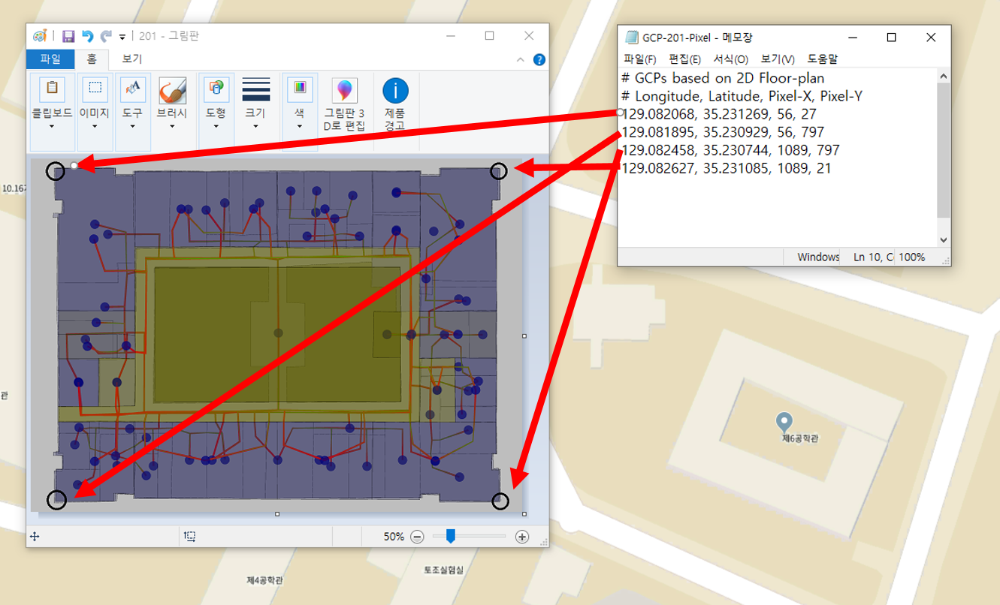
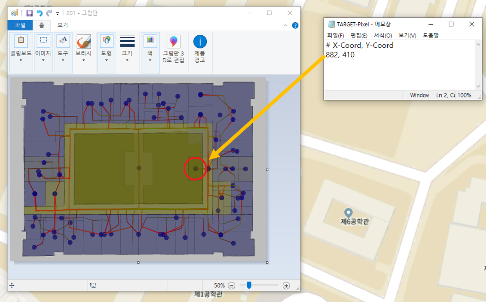
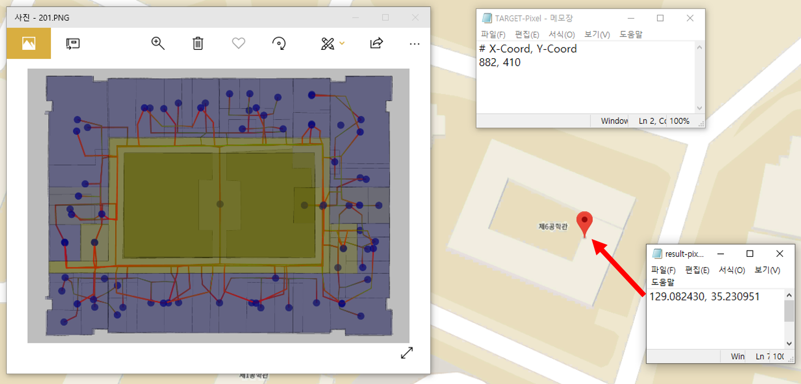

# ConvertModule
Coordinate converting module with console application for Java

## How to use this code for poets.

 0. Working folder is  
    C:\ConvertTool  
    (C:\ConvertTool\Convert.java...)

 1. Download GDAL (Compiled binaries in a single .zip package)  
    http:www.gisinternals.com/query.html?content=filelist&file=release-1900-x64-gdal-2-4-0-mapserver-7-2-2.zip

 2. Extract zip file to C:\gdal

 3. Copy C:\gdal\bin\gdal\java\gdalalljni.dll  
      to C:\gdal\bin

 4. Add Path  
   "C:\gdal\bin"  
   "C:\gdal\bin\gdal\apps"

 5. Set environment value  
    set GDAL_DATA=C:\gdal\bin\gdal-data

 6. Compile  
    javac Convert.java -classpath c:\gdal\bin\gdal\java\gdal.jar

 7. Run with samples  
    java -cp .;c:\gdal\bin\gdal\java\gdal.jar Convert GCP-201-Pixel.txt TARGET-Pixel.txt result-pixel.txt

## Input GCPs file structure.

## Input target pixel file structure.

## Result file structure.

